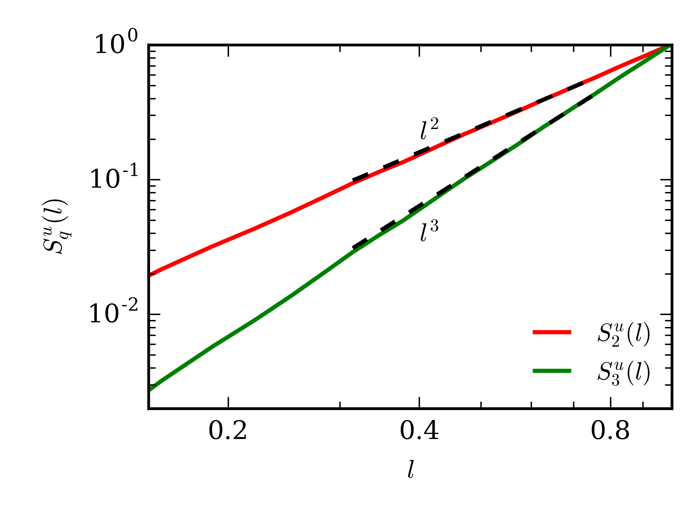
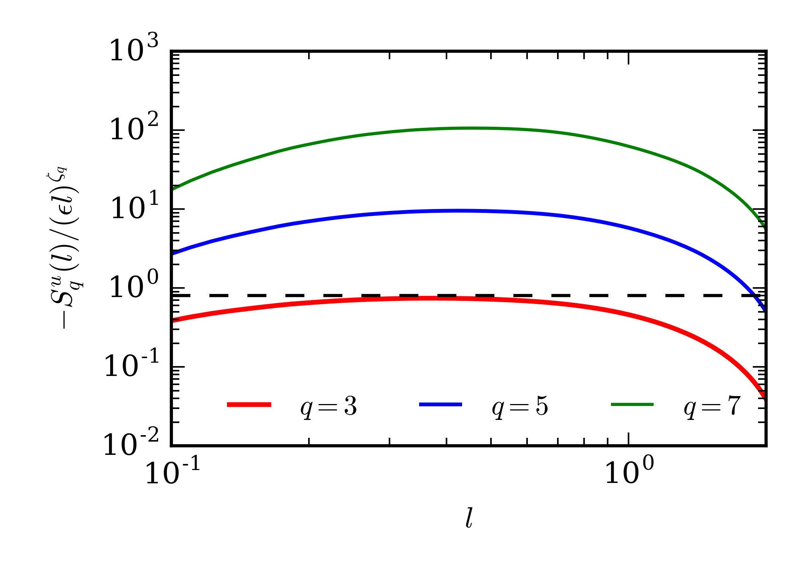

# Summary

Turbulence is a highly complex phenomenon in fluid dynamics involving nonlinear interactions between a large number of scales. Structure function is a popular diagnostics tool to study the statistical properites of turbulent flows [@Frisch:book; @Verma:book:ET]. Some of the works comprising of such analysis are those of @Gotoh:PF2002, @Kaneda:PF2003, and @Ishihara:ARFM2009 for three-dimensional homogeneous isotropic turbulence; @Yeung:PF2005 and @Ray:NJP2008 for passive scalar turbulence; @Biferale:NJP2004 for two-dimensional turbulence; and @Kunnen:PRE2008 and @Kaczorowski:JFM2013 for turbulent thermal convection. Structure functions are two-point statistical quantities; thus, an accurate computation of these quantities requires averaging over many points. However, incorporation of a large number of points makes the computations very expensive and challenging. Therefore, we require an optimised code employing parallel computing for accurate computation of structure functions. In this paper, we describe the design and validation of the results of ``Kolmogorov41``, a hybrid parallel code to compute velocity and scalar structure functions. 

 ``Kolmogorov41`` employs a combination of distributed (MPI) and shared (OpenMP) memory parallelization [@Pacheco:book:PP] to compute the structure functions using given velocity or scalar field data. In this code, the entire data is shared among all the MPI processes. This eliminates the need of communication between the processors. Thus, we save considerable time that would otherwise be spent on communication. The user has a choice on the type (scalar or vector) and the dimensions of the fields to be read by the code, and the range of orders of the structure functions to be computed. The code writes the computed structure functions to hdf5 files that can be further processed by the user. We remark that our code has been used by @Bhattacharya:PF2019 for analysing the longitudinal velocity structure functions of turbulent thermal convection.

In the next section, we will briefly define the velocity and the scalar structure functions of turbulent flows.

# Velocity and scalar structure functions

Let $\mathbf{u}$ and $\theta$ be velocity and scalar fields respectively. For any two points $\mathbf{r}$ and $\mathbf{r+l}$, we define the velocity differential to be $\delta \mathbf{u} = \mathbf{u(r+l)}-\mathbf{u(r)}$. Further, we denote $\delta u_\parallel=\delta \mathbf{u}\cdot \hat{\mathbf{l}}$ as the component of the velocity differential along the vector $\mathbf{l}$, and $\delta u_\perp= |\delta \mathbf{u} - \delta u_\parallel \hat{\mathbf{l}}|$ as the component of the velocity differential perpendicular to $\mathbf{l}$. Assuming statistical homogeneity, we define the longitudinal velocity structure functions of order $q$ as
$$ S_q^{u_\parallel}(\mathbf{l}) = \langle \delta u_\parallel^q \rangle,$$ 
and the transverse velocity structure functions order 
$q$ as 
$$ S_q^{u_\perp}(\mathbf{l}) = \langle \delta u_\perp^q \rangle. $$ 

Here, $\langle \cdot \rangle$ denotes ensemble averaging. We can also define the scalar differential to be $\delta \theta = \theta (\mathbf{r+l}) - \theta(\mathbf{r})$, and the scalar structure functions (assuming statistical homogeneity) as 
$$ S_q^\theta(\mathbf{l}) = \langle \delta \theta^q\rangle. $$
If the turbulence is isotropic in addition to being homogeneous, the structure functions become functions of $l$, where $l=|\mathbf{l}|$. In turbulent flows, the second-order velocity structure functions provide an estimate of energy in all the eddies of size $l$ or less [@Davidson:book:Turbulence]. 

In the next section, we provide a brief description of the design of the code.

# Design of the Code
``Kolmogorov41``  uses the Blitz++ library for vectorized array operations. The velocity structure functions ($S_q^{u_\parallel}(l)$ and $S_q^{u_\perp}(l)$) and the scalar structure functions ($S_q^{\theta}(l)$) are computed and stored in a Blitz array. ``Kolmogorov41`` contains separate functions for computing the scalar and the velocity structure functions. Also, separate functions are called for two-dimensional or three-dimensional input fields. However, the basic design of all the functions is the same, and is described below.

`Kolmogorov41` employs six nested "for" loops for computation of structure functions using three-dimensional fields. The outer three loops describe the position vector $\mathbf{r}=(x_1,y_1,z_1)$, and the inner three describe the position vector $\mathbf{r+l}=(x_2,y_2,z_2)$. For two-dimensional fields, the code employs four nested "for" loops, with the outer two describing $\mathbf{r}=(x_1,z_1)$ and the inner two describing $\mathbf{r+l}=(x_2,z_2)$. The innermost loop corresponds to a particular value of $l$. Inside this loop, the code computes $(\delta u_\parallel)^q$ and $(\delta u_\perp)^q$ for the velocity structure functions, or $(\delta \theta)^q$ for the scalar structure functions, and increments these quantities to the corresponding element of the structure function array. For averaging, the code divides the structure functions array by another array that stores the number of times the innermost loop corresponds to a particular value of $l$.

Additionally, as per the choice of the user, `Kolmogorov41` can also compute and store the structure functions as functions of the displacement vector $\mathbf{l}$. This form is useful for anisotropic homogeneous turbulence such as rotating or stably-stratified flows.

Using the definition of the longitudinal structure functions, it can be shown that $S_q^{u_\parallel}(\mathbf{l})= S_q^{u_\parallel}(\mathbf{-l})$. If the user decides to compute only the longitudinal velocity structure functions, `Kolmogorov41` exploits the aforementioned property by not separately evaluating $S_q^{u_\parallel}(\mathbf{-l})$. This results in saving significant computational costs.

We use a combination of MPI and OpenMP to parallelize our code.  The interval of the outermost "for" loop described earlier in this section is divided among MPI processors. Using OpenMP threads, we parallelize the second "for" loop. Note that the entire data is accessible to all the MPI processors, thereby eliminating the need of communication between the processsors. This hybrid parallelization allows us to use a maximum of $N_x \times p$ processors, where $N_x$ is the number of grid points along $x$ direction and $p$ is either the number of processors per computation node or the number of grid points along $y$ direction (or $z$ direction for 2D fields), whichever is less.  

In the next section, we discuss the validation of our code.
 
# Results

We validate `Kolmogorov41` by using it to compute the structure functions for specific cases, and then comparing our results with those obtained analytically.

### Problem 1

We consider the following two-dimensional velocity and scalar fields:
$$\mathbf{u} = 
\begin{bmatrix} 
x \\ z
\end{bmatrix}, \quad \theta = x+z.
$$
For the given fields, it can be analytically shown that the longitudinal and the transverse velocity structure functions, and the scalar structure functions are given by 
$$S_q^{u_\parallel} = (l_x^2 + l_z^2)^{q/2} = l^q,$$
$$S_q^{u_\perp} = 0,$$
$$S_q^\theta = (l_x+l_z)^q.$$
We run ``Kolmogorov41`` to compute the velocity and scalar structure functions using the given fields of $32^2$ grid resolution with the domain size of $1 \times 1$.  In Figure \ref{SFTest}, we plot the second and the third-order longitudinal velocity structure functions versus $l$. Clearly, $S_2^{u_\parallel}(l)$ and $S_3^{u_\parallel}(l)$ equal $l^2$ and $l^3$ respectively, consistent with the analytically obtained values. Figure \ref{SFScalar} exhibits the density plots of the computed second-order scalar structure functions $S_2^{\theta}(\mathbf{l})$, along with $(l_x + l_z)^2$. The two plots are identical, thus showing that the scalar structure functions are computed correctly.

This problem is used as a test case for the validation of the code. The user is required to set the "test_switch" in the parameters file (para.yaml) to "true". On doing so, the code generates the velocity and the scalar fields as per the given relation. After computing the structure functions, the code computes the percentage error between the theoretical and the computed values of the structure functions. If the error does not exceed $1\times 10^{-10}$, the code is deemed to be passed.

### Problem 2

Here, we consider the classical problem of three-dimensional incompressible homogeneous isotropic turbulence. For such flows, we consider the inertial range, which comprises of scales lying between the large-scale forcing regime and the small-scale dissipation regime. In this range, the third-order longitudinal velocity structure function is given by
$$S_3^{u_\parallel}(l) = -\frac{4}{5} \epsilon l,$$
where $\epsilon$ is the viscous dissipation rate [@Kolmogorov:Dissipation; @Kolmogorov:Structure]. In a general case, for any order $q$, @She:PRL1993 proposed that the longitudinal structure functions scale as $S_3^{u_\parallel}(l) \sim l^{\zeta_q}$, where the exponent $\zeta_q$ is given by 
$$ \zeta_q = \frac{q}{9} + 2 \left ( 1 - \left ( \frac{2}{3} \right )^{q/3} \right ).$$ 

We compute the longitudinal velocity structure functions of orders 2 to 7 using the simulation data of three-dimensional homogeneous isotropic turbulence with Reynolds number (Re) of 5700. The simulation was performed using TARANG [@Verma:Pramana2013tarang; @Chatterjee:JPDC2018] on a $512^3$ grid with the domain size of ($2\pi \times 2\pi \times 2\pi$). For more details on the simulation, refer to @Sadhukhan:PRF2019. We run ``Kolmogorov41`` on a Cray XC40 system (Shaheen II of KAUST) to compute the structure functions, employing 512 MPI processes with 1 MPI and 32 OpenMP processes per computation node. The code took $5 \times 10^4$ seconds to complete the computations under the aforementioned parallelization configuration.

We normalize the third, fifth, and seventh-order longitudinal velocity structure functions with $(\epsilon l)^{\zeta_q}$, where $\zeta_q$ is given by She-Leveque's relation. We plot the negative of these quantities versus $l$ in Figure \ref{Hydro}. 
The figure clearly shows that in the inertial range ($0.3<l<0.8$), the normalized third-order longitudinal velocity structure function is fairly close to $4/5$ (represented by dashed line), consistent with Kolmogorov's theory. Moreover, the normalized fifth and seventh-order structure functions show a plateau for the same range of $l$, thus showing consistency with She-Leveque's model.

The results obtained from Problems 1 and 2 thus validate ``Kolmogorov41``.  

# Acknowledgements

We thank R. Samuel, A. Chatterjee, S. Chatterjee, and M. Sharma for useful discussions during the development of ``Kolmogorov41``. Our computations were performed on Shaheen II at KAUST supercomputing laboratory, Saudi Arabia, under the project k1052. 

---

# References

